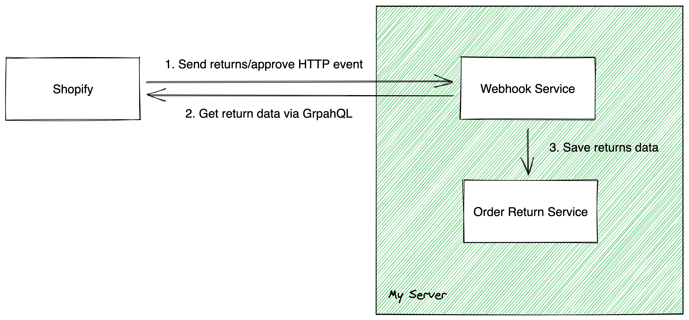

# Shopify Webhook Demo

This project intends to demonstrate receiving webhook events from Shopify. returns/approve webhook event will be used in this project.

---

## Introduction

The following points are an overview of the entire webhook project.

- Rest API facing Shopify webhook (Spring Webflux)
  - https://docs.spring.io/spring-framework/docs/current/reference/html/web-reactive.html
- GraphQL web client facing a target backend (DGS GraphQL and Codegen)
  - https://netflix.github.io/dgs/
- Shopify API (version: 2023-01)
  - returns/approve webhook doesn't exist before this version

## System Architecture



---

## Project Setup

### IntelliJ IDEA Settings

- Java 17
- OpenJDK 17 JRE
- Recommended plugins
  - Lombok
  - DGS (https://plugins.jetbrains.com/plugin/17852-dgs)
  - GraphQL (https://plugins.jetbrains.com/plugin/8097-graphql)
  - Markdown

### Shopify account

- Create an app for your store under Settings / Apps and sales channels

- Grant API access scopes: read_returns (https://shopify.dev/api/admin-graphql/2023-01/objects/Return)

- Generate API access token, API key and Secret key

### Environemnt variables

- Create an application-local.yaml with the following content

```yaml
api:
  base-url: <insert your server base url>
  returns-uri: <insert your returns uri>

shopify:
  graphql-endpoint: https://<replace with your Shopify subdomain>.myshopify.com/admin/api/2023-01/graphql.json
  access-token: <copy your Shopify access token generated from your Shopify account>
  secret-key: <copy your Shopify secret key generated from your Shopify account>
  
server:
  port: <if you prefer port other than 80>
```

### Gradle Properties

- gradle.properties defines the following properties

```properties
# set global spring boot version for gradle plugin
springBootVersion=3.0.1
# to reuse outputs from previous builds for all builds, visit https://docs.gradle.org/current/userguide/build_cache.html for more details
org.gradle.caching=true
```

### Gradle Settings

- settings.gradle defines the configuration

```groovy
buildCache {
    local {
        // define the duration for invalidating build cache
        removeUnusedEntriesAfterDays = 30
    }
}
```

---

## Run (local bootRun)

1. Run the Gradle task `generateJava` under `dgs graphql codegen`
2. Run the Gradle task `bootRun` under `application`

### Setup testing environment for stimulating Shopify webhook

1. Register a new Shopify returns/approve webhook subscription (https://shopify.dev/api/admin-graphql/2023-01/enums/WebhookSubscriptionTopic)

2. Install ngrok in your local computer (https://ngrok.com/docs/getting-started)

3. Start ngrok at port 80 (or other port number you prefer)
  > ngrok http 80

4. Create an new order with fulfillments, then create returns in the Shopify management portal

5. Shopify subdomain mapping will be ignored when the application environment is `"local"`. The store code will be default to be `"99999"`

---

## Run (local docker)

1. Build docker image to local registry

- Run the Gradle task `jibDockerBuild` under jib

2. Run docker-compose under the project root directory

> docker-compose up -d

3. Show the application logs

> docker-compose logs -f

---

## Build docker image (Production)

Jib is included in the build.gradle for building docker image from byte codes.
The following codes could be included in your CI/CD process.

Please visit https://github.com/GoogleContainerTools/jib for more details.

> imageName = {containerRegistry}/{serviceName}/{optionalImageName}

> ./gradlew jib -Djib.to.image={imageName} -Djib.to.auth.username={USERNAME} -Djib.to.auth.password={PASSWORD} -Djib.to.tags=latest -Djib.container.creationTime=USE_CURRENT_TIMESTAMP

---

## Exception Handling

Define in exception classes and handle by GlobalExceptionHandler

- Incorrect Shopify Topic
- Invalid Shopify Hmac Header
- Missing Shopify header

---

## Appendix

### 1. GrpahQL mutation for subscribing Shopify returns/approve webhook

```graphql
mutation createSubscription{
    webhookSubscriptionCreate(
        topic: RETURNS_APPROVE
        webhookSubscription: {
            format: JSON,
            callbackUrl: "<insert your http endpoint url>"}
    ) {
        userErrors {
            field
            message
        }
        webhookSubscription {
            id
        }
    }
}

```

### 2. GraphQL mutation for removing Shopify returns/approve webhook subscription

```graphql
mutation webhookSubscriptionDelete {
  webhookSubscriptionDelete(id: "<insert the webhook subscription id generated by the webhookSubscriptionCreate mutation >") {
    deletedWebhookSubscriptionId
    userErrors {
      field
      message
    }
  }
}
```

### 3. GraphQL Query for getting Shopify Returns data

```graphql
query returnDetails {
    return(id: "<insert your return id>") {
        order {
            id
            fulfillments {
                trackingInfo {
                    company
                    number
                }
            }
        }
        returnLineItems (first: 50) {
            edges {
                node {
                    returnReason
                    fulfillmentLineItem {
                        lineItem {
                            id
                            name
                            quantity
                            sku
                        }
                    }
                }
            }
        }
    }
}
```